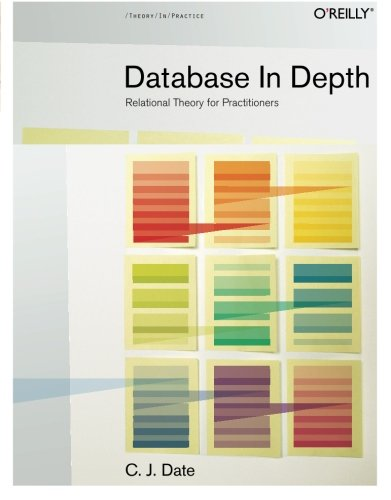

--- 
date: 2014-01-10T11:02:00Z
link: http://inessential.com/2014/01/02/vesper_sync_diary_7_audibles
title: Brent Simmons is Not Wrong
url: /theory/2014/01/10/brent-simmons-is-not-wrong/

categories: [theory]
---

Brent Simmons:

> Database people are already gasping for air, because they know what’s coming.
> Instead of creating a separate table for attachment metadata, I created an
> attachments column in the notes table and just encoded the attachment
> metadata there.
> 
> On iOS it uses Core Data’s built-in object archiving feature. On the server
> it’s stored as JSON.
> 
> This is wrong, surely; it’s not how to do this. Except, in this case, it is.
> Incomplete object graphs are wrong; inefficient and slower syncing with more
> complex server-side code is also wrong.
>
> This is *less wrong than the alternatives.*

Some database folks might be gasping for air, but not those of us steeped in
relational theory. In *[Database in Depth]*, relational theorist [C.J. Date]
poses a question:

> In Chapter 1, I said that 1NF meant that every tuple in every relation
> contains just a single value (of the appropriate type, of course) in every
> attribute position---and it’s usual to add that those “single values” are
> supposed to be atomic. But this latter requirement raises the obvious
> question: what does it mean for data to be atomic?
> 
> Well, on page 6 of the book mentioned earlier, Codd defines atomic data as
> data that “cannot be decomposed into smaller pieces by the DBMS (excluding
> certain special functions).” But even if we ignore that parenthetical
> exclusion, this definition is a trifle puzzling, and not very precise. For
> example, what about character strings? Are character strings atomic? Every
> product I know provides several operators on such strings—LIKE, SUBSTR
> (substring), “||” (concatenate), and so on—that clearly rely on the fact that
> character strings in general can be decomposed by the DBMS. So are those
> strings atomic? What do you think?

The whole book is worth a read, especially the first four chapters, as it
does an excellent job of dispelling the myth that complex data types are
verboten in a properly normalized relational model. Another gem:

> But I could have used any number of different examples to make my point: I
> could have shown attributes (and therefore domains) that contained arrays; or
> bags; or lists; or photographs; or audio or video recordings; or X rays; or
> fingerprints; or XML documents; or any other kind of value, “atomic” or
> “nonatomic,” that you might care to think of. Attributes, and therefore
> domains, can contain anything (any values, that is). All of which goes a long
> way, incidentally, toward explaining why a true “object/relational” system
> would be nothing more nor less than a true relational system—which is to say,
> a system that supports the relational model, with all that such support
> entails.

This is exactly why PostgreSQL offers [array], [XML], and [JSON] data types:
because sometimes, they are exactly what you need to properly model your
system.

So you go, Brent, you're doing it exactly right.

[Database in Depth]: http://www.amazon.com/Database-Depth-Relational-Theory-Practitioners/dp/0596100124/justatheory-20
[C.J. Date]: http://en.wikipedia.org/wiki/Christopher_J._Date
[array]: http://www.postgresql.org/docs/current/static/arrays.html
[XML]: http://www.postgresql.org/docs/current/static/datatype-xml.html
[JSON]: http://www.postgresql.org/docs/current/static/datatype-json.html

